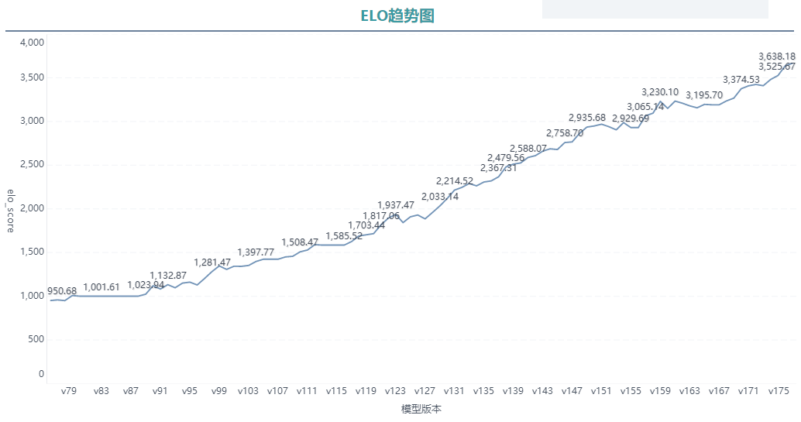
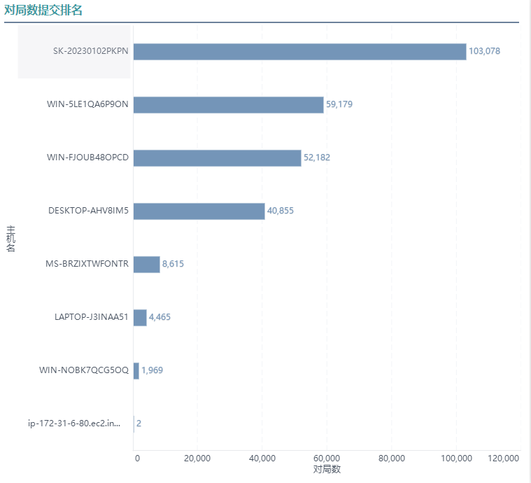

# open_chess_zero
一、硬件环境

1．显卡：gtx1050以上

2．系统：windows 7/10/11

 

二、软件环境

1．Python 3.6.8~3.8.8

2．cuda 11.3: https://developer.nvidia.com/cuda-toolkit-archive

3．cudnn : https://developer.nvidia.com/rdp/cudnn-download

4．torch torch-1.10.0+cu113-cp38-cp38-win_amd64.whl

5．torchvision torchvision-0.11.0+cu113-cp38-cp38-win_amd64.whl

6．torch下载地址：https://download.pytorch.org/whl/torch_stable.html

7．其他依赖：pip install -r config/requirements.txt

 

三、运行

1．生成棋谱

（1）python production.py

2．训练和评估模型

（1）python train_sub.py

 

四、可视化

（1）

（1）

